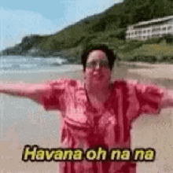

# Havannah-Agent
<<<<<<< HEAD

1) Move choosing crteria in MCTS: most visits, wins, winning rate, lower confidence bound
2) Preference of winning condition with size, 
3) At lower sized boards prefer bridge and fork.
4) At higher sizes prefer rings

=======

>>>>>>> 0f055d2c403b0df1e502155bd5416d1cbbf5a466
